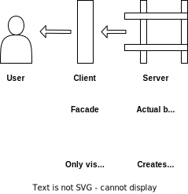

<!-- Improved compatibility of back to top link: See: https://github.com/STASYA00/Frontend_Template/pull/73 -->
<a name="readme-top"></a>

[![Contributors][contributors-shield]][contributors-url]
[![Forks][forks-shield]][forks-url]
[![Stargazers][stars-shield]][stars-url]
[![Issues][issues-shield]][issues-url]
[![MIT License][license-shield]][license-url]
[![LinkedIn][linkedin-shield]][linkedin-url]


<!-- PROJECT LOGO -->
<br />
<div align="center">
  <a href="https://github.com/STASYA00/Frontend_Template">
    
    
  </a>

  <h3 align="center" IAAC: Code Architecture Basics & Model Deployment </h3>

  <p align="center">
    Frontend Template
    <br />
    <!-- <a href="https://colab.research.google.com/github/STASYA00/Frontend_Template/blob/main/">View Demo</a> -->
    ·
    <a href="https://github.com/STASYA00/Frontend_Template/issues">Report Bug</a>
    ·
    <a href="https://github.com/STASYA00/Frontend_Template/issues">Request Feature</a>
  </p>
</div>


<!-- TABLE OF CONTENTS -->
<details>
  <summary>Table of Contents</summary>
  <ol>
    <li>
      <a href="#about-the-project">About The Project</a>
      <ul>
      <li><a href="#intro">Intro</a></li>
        <li><a href="#built-with">Built With</a></li>
      </ul>
    </li>
    <li>
      <a href="#getting-started">Getting Started</a>
      <ul>
        <li><a href="#prerequisites">Prerequisites</a></li>
        <li><a href="#usage">Usage</a></li>
        <li><a href="#deployment">Deployment</a></li>
      </ul>
    </li>
    <li><a href="#license">License</a></li>
    <li><a href="#contact">Contact</a></li>
    <li><a href="#acknowledgments">Acknowledgments</a></li>
  </ol>
</details>


<!-- ABOUT THE PROJECT -->
## About The Project

An easy (and free) way to start a web app. Use this template to make quick web app prototypes!
### Intro

Every webapp that I've made in the last few years includes setting up a simple client side that sends a request to the backend. This project makes an almost-ready template for the client side. \
\
 \
\
The idea is simple: the actual html is constructed on the server side. This template belongs to the client side and the only thing it does is sending the request to get the desired html. Then the body is replaced. The website is styled in ```css/style.css```.


<p align="right">(<a href="#readme-top">back to top</a>)</p>


### Built With


* [Nodejs](https://nodejs.org/en)
* [Fetch](https://developer.mozilla.org/en-US/docs/Web/API/Fetch_API/Using_Fetch)
* [node.html-parser](https://www.npmjs.com/package/node-html-parser)

<p align="right">(<a href="#readme-top">back to top</a>)</p>


<!-- GETTING STARTED -->
## Getting Started

Clone the repo (or fork to deploy it as a github page)
```$ git clone https://github.com/STASYA00/Frontend_Template.git``` 

### Prerequisites
None
<p align="right">(<a href="#readme-top">back to top</a>)</p>
<!-- USAGE EXAMPLES -->

### Usage

* In ```js/main.js``` replace ```WEBSITE``` (line 9) with your endpoint (e.g. ```http://localhost:3000``` to test it with a local server).
* Your endpoint should return ```{KEY : HTML}```, where ```KEY``` is a string (e.g. ```"content"```) and ```HTML``` is html page as a string (e.g. ```"<html><head></head><body><div id="root"></div></body></html>"```)
* In ```js/main.js``` replace ```content```(line 11) with your key (e.g. ```"key"```).

<p align="right">(<a href="#readme-top">back to top</a>)</p>

### Deployment

* Fork this repo
* Replace the values from the [Usage](#usage) section
* [Set up](https://docs.github.com/en/pages/getting-started-with-github-pages/creating-a-github-pages-site) the repo as a github page

**Bonus:** for the page to be searchable by Google:
* Control your website address with [google search console](https://search.google.com/search-console/welcome)
* If it is not registered, add HTML tag (from the pop-up window) to the ```index.html```: uncomment line 5 ( ```<meta name="google-site-verification" content="xxxxxxxxxxxxx-xxxxxxxxxxxxxxxxx-xxxxxxxxxxx" />```) and replace content with the tag from the pop-up window
* It will take a couple of days for your website to become searchable

<p align="right">(<a href="#readme-top">back to top</a>)</p>

<!-- LICENSE -->
## License

Distributed under the MIT License. See `LICENSE.txt` for more information.

<p align="right">(<a href="#readme-top">back to top</a>)</p>


## Contact

Stasja - [@stasya00](https://stasyafedorova.wixsite.com/designautomation) - [e-mail](mailto:0.0stasya@gmail.com) - [LinkedIn][linkedin-url]

<p align="right">(<a href="#readme-top">back to top</a>)</p>


<!-- ACKNOWLEDGMENTS -->
## Acknowledgments

* [My favorite README template](https://github.com/othneildrew/Best-README-Template)

<p align="right">(<a href="#readme-top">back to top</a>)</p>


<!-- MARKDOWN LINKS & IMAGES -->
<!-- https://www.markdownguide.org/basic-syntax/#reference-style-links -->
[contributors-shield]: https://img.shields.io/github/contributors/STASYA00/Frontend_Template.svg?style=for-the-badge
[contributors-url]: https://github.com/STASYA00/Frontend_Template/graphs/contributors
[forks-shield]: https://img.shields.io/github/forks/STASYA00/Frontend_Template.svg?style=for-the-badge
[forks-url]: https://github.com/STASYA00/Frontend_Template/network/members
[stars-shield]: https://img.shields.io/github/stars/STASYA00/Frontend_Template.svg?style=for-the-badge
[stars-url]: https://github.com/STASYA00/Frontend_Template/stargazers
[issues-shield]: https://img.shields.io/github/issues/STASYA00/Frontend_Template.svg?style=for-the-badge
[issues-url]: https://github.com/STASYA00/Frontend_Template/issues
[license-shield]: https://img.shields.io/github/license/STASYA00/Frontend_Template.svg?style=for-the-badge
[license-url]: https://github.com/STASYA00/Frontend_Template/blob/master/LICENSE.txt
[linkedin-shield]: https://img.shields.io/badge/-LinkedIn-black.svg?style=for-the-badge&logo=linkedin&colorB=555
[linkedin-url]: https://linkedin.com/in/stanislava-fedorova
[product-screenshot]: assets/screenshot.png


